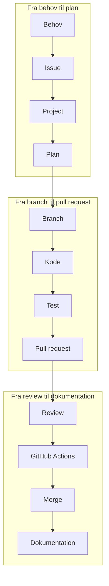
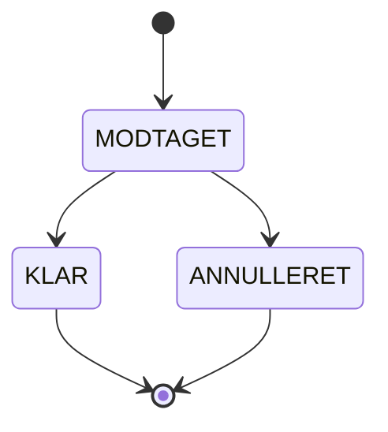
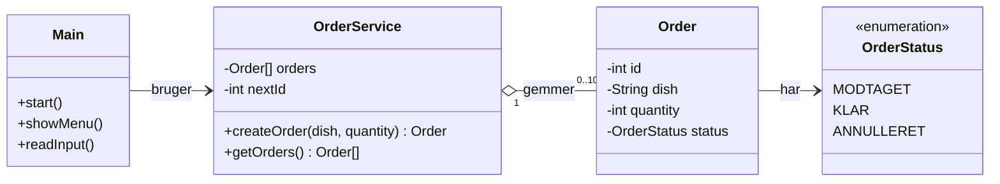
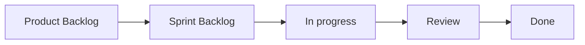

# ByteBites – festivalens foodtruck

Denne workshop viser en sammenhængende, AI-understøttet udviklingsproces fra behov til færdig og dokumenteret løsning. Vi arbejder med samme enkle konsolapplikation i enten Java eller C#/.NET.

<!-- INDSÆT FIGUR HER: images/00-bytebites-foodtruck.png -->

> [!IMPORTANT]
> AI-genereret kode er først færdig, når den er forstået, testet, reviewet og koblet til et issue.

## Overblik

Workshoppen varer cirka to timer.

| Tid | Del | Resultat |
|---|---|---|
| 00:00–00:20 | Introduktion og klargøring | Eget repository, GitHub Project og kørende startkode |
| 00:20–01:35 | Fælles flow | Issue #1 gennemføres fra Product Backlog til Done |
| 01:35–01:50 | Selvstændig afprøvning | Et nyt issue afklares og flyttes til Sprint Backlog |
| 01:50–02:00 | Opsamling | Sporbarhed, faglig refleksion og menneskets ansvar |

Det samlede flow er:



*Figur 1: Det samlede udviklingsflow.*

## Case og afgrænsning

ByteBites er en foodtruck på en festival. Medarbejderne har brug for en lille konsolapplikation til at holde styr på bestillinger.

Applikationen skal:

- have tre faste retter
- oprette en bestilling med ret og antal
- tildele hver bestilling et unikt id
- starte nye bestillinger med status `MODTAGET`
- afvise ugyldige retter og antal
- vise den oprettede bestilling
- gemme højst ti bestillinger i hukommelsen

Vi bruger ikke database, webgrænseflade, Spring Boot, ASP.NET, eksterne frameworks eller avancerede design patterns.

En bestilling kan bevæge sig gennem disse statusser:



*Figur 2: En bestillings mulige statusforløb.*

## Applikationens klasser

Klassediagrammet viser den fælles, enkle struktur for Java- og .NET-løsningen. Metodenavne og datatyper kan tilpasses sproget.



*Figur 3: Klasserne i ByteBites-applikationen.*

## Faglig kobling

| Fag | Fokus i workshoppen |
|---|---|
| Systemudvikling | Behov, user story, acceptkriterier, afklaring og opdeling af issues, Project og sporbarhed |
| Programmering | Kode, struktur, validering, test, debugging og forklaring |
| Teknologi | Git, branches, build, GitHub Actions, runtime og teknisk kvalitet |
| IT- og forretning | Forretningsværdi, prioritering, scope, arbejdsgange og ansvar |

## Copilot-arbejdsformer

| Arbejdsform | Bruges til | Menneskets ansvar |
|---|---|---|
| Ask | Forstå kode, fejl, Git og test | Kontrollere og kunne gengive forklaringen |
| Plan | Planlægge løsningen uden kode | Vurdere scope, rækkefølge og acceptkriterier |
| Agent | Implementere en tydelig, afgrænset opgave | Gennemgå, teste og godkende ændringerne |

> [!TIP]
> Brug Ask før forståelse, Plan før implementering og først Agent, når opgaven er tydelig og afgrænset.

## Hvor arbejder vi?

I workshoppen skifter vi mellem GitHub og IDE'en. Hvert praktisk trin er derfor markeret med arbejdssted.

| Markering | Her arbejder I med |
|---|---|
| **GitHub** | Repository, issues, labels, Project, branches, pull requests, review og Actions |
| **IDE** | Copilot, kode, lokale test, Git-kommandoer og kørsel af programmet |
| **GitHub og IDE** | En handling, der starter det ene sted og fortsætter det andet |

# Del 1: Introduktion og klargøring

## 1. Opret jeres repository fra en starter

### GitHub – fælles gennemgang

Vælg det starter-repository, der passer til jeres teknologispor:

- [ByteBites Java starter](https://github.com/krollchristensen/bytebites-java-starter)
- [ByteBites .NET starter](https://github.com/krollchristensen/bytebites-dotnet-starter)

Et template-repository opretter et nyt, selvstændigt repository med den valgte startkode. Det nye repository indeholder ikke historikken fra starter-repositoryet.

### GitHub – I gør

1. Åbn starter-repositoryet til Java eller .NET.
2. Vælg **Use this template → Create a new repository**.
3. Vælg jeres egen GitHub-konto som ejer.
4. Giv repositoryet navnet `bytebites-workshop`.
5. Vælg **Create repository**.
6. Kontrollér, at repositoryet indeholder startkoden, og at Branch hedder `main`.

### IDE – I gør

1. Klon jeres nye repository.
2. Åbn det klonede repository i jeres IDE.
3. Kontrollér, at den aktive branch er `main`.
4. Kontrollér, at `src/Main.java` eller `Program.cs` findes.

## 2. Opret GitHub Project

### GitHub – fælles gennemgang

Opret et Project i board-visning. Brug præcis disse statusser og denne rækkefølge:



*Figur 4: Issuets bevægelse gennem GitHub Project.*

| Status | Betydning |
|---|---|
| Product Backlog | Behov eller opgaver, der endnu ikke er valgt til den aktuelle sprint |
| Sprint Backlog | Afklarede og prioriterede issues, der er valgt til workshopforløbet |
| In progress | Issues, som nogen aktivt arbejder på |
| Review | Implementeringen venter på fagligt review og automatiske kontroller |
| Done | Løsningen er reviewet, godkendt og merget |

### GitHub – I gør

1. Opret jeres eget Project.
2. Omdøb eller opret statusserne, så de svarer præcist til figuren.
3. Kontrollér rækkefølgen fra Product Backlog til Done.

Et repository-issue skal senere tilføjes direkte til Project. Issuet er selv kortet på boardet; opret ikke et separat draft-kort med samme tekst.

## 3. Kør startprojektet

Startkoden følger med fra det valgte template-repository. Hovedforløbet er det samme i begge teknologispor.

<details>
<summary>Java i IntelliJ IDEA</summary>

### Krav

- IntelliJ IDEA
- Java 21

### Kør projektet

1. Åbn jeres eget repository i IntelliJ.
2. Kontrollér, at Project SDK er Java 21.
3. Åbn `src/Main.java`.
4. Kør `Main`.

Fra terminalen i roden af jeres eget repository kan startkoden kontrolleres med:

```bash
javac -d out src/Main.java
java -cp out Main
```


</details>

<details>
<summary>C#/.NET i Visual Studio eller VS Code</summary>

### Krav

- .NET 10 SDK
- Visual Studio eller VS Code med C#-udvidelsen

### Kør projektet

1. Åbn jeres eget repository i Visual Studio eller VS Code.
2. Åbn `Program.cs`.
3. Kør projektet fra IDE'en eller terminalen.

```bash
dotnet run
```

Kontrollér også, at projektet kan bygges uden at starte det interaktive program:

```bash
dotnet build
```


</details>

### IDE – brug Ask til at forstå startkoden

Kopiér denne prompt ind i **Copilot Chat i IDE'en**, og vælg Ask:

```text
Forklar startkoden kort. Beskriv programmets flow, data og validering.
Peg også på det, der endnu mangler for at kunne oprette en bestilling.
Skriv ikke kode.
```

### Tjek før I fortsætter

- Repositoryet bruger `main`.
- Project har de fem korrekte statusser.
- Startprojektet kan køres i den valgte IDE.
- I kan forklare, hvad startkoden gør.

# Del 2: Fælles flow – issue #1

Vi gennemfører det samme issue hele vejen fra Product Backlog til Done.

## 4. Behov, issue og Product Backlog

### GitHub – fælles gennemgang

Opret et repository-issue med titlen:

```text
Opret en bestilling
```

Brug denne beskrivelse:

### Forretningsbehov

ByteBites skal kunne registrere nye bestillinger hurtigt og korrekt, så medarbejderne kan se, hvad der skal tilberedes.

### User story

Som medarbejder vil jeg kunne oprette en bestilling med ret og antal, så køkkenet kan tilberede det rigtige.

### Acceptkriterier

- Brugeren kan vælge en af de tre gyldige retter.
- Brugeren kan indtaste et positivt antal.
- Bestillingen får et unikt id.
- En ny bestilling får status `MODTAGET`.
- Bestillingen vises efter oprettelse.
- Ugyldig ret eller ugyldigt antal afvises med en forståelig besked.
- Programmet crasher ikke ved forkert input.
- Der kan højst gemmes ti bestillinger.

### Afgrænsning

Bestillinger gemmes kun i hukommelsen. Issuet omfatter ikke database, betaling, webgrænseflade eller ændring af en bestillings status.

### Definition of done

- Acceptkriterierne er kontrolleret.
- Koden er forstået og gennemgået.
- Manuelle test er dokumenteret i pull requesten.
- Den automatiske kontrol er grøn.
- Pull requesten er reviewet og merget.

### Hvorfor anvender vi labels?

Labels gør det hurtigt at se, hvilken type arbejde et issue indeholder, og hvilke fag der bidrager. De gør det også muligt at filtrere Product Backlog. Status som `In progress` og `Done` styres i Project og skal derfor ikke oprettes som labels.

Brug `feature` til opgavetypen og `programmering`, `systemudvikling` og `teknologi` til de faglige områder i issue #1.


### GitHub – opret issue #1

1. Åbn fanen **Issues** i jeres eget repository, og vælg **New issue**.
2. Skriv titlen `Opret en bestilling`.
3. Kopiér teksten fra **Forretningsbehov** til og med **Definition of done** ovenfor ind i issuets beskrivelsesfelt.
4. Tilføj labels `feature`, `programmering`, `systemudvikling` og `teknologi`.
5. Vælg **Submit new issue**.
6. Tilføj det oprettede issue direkte til Project.
7. Placér issuet i `Product Backlog`.
8. Kontrollér, at issuets Project-felt viser det rigtige Project.

### Fagligt stop

Drøft i to minutter:

- Hvilken forretningsværdi giver issuet?
- Kan acceptkriterierne testes?
- Kan issuet gennemføres fra Sprint Backlog til Done i den fælles gennemgang?

**GitHub:** Når issuet er afklaret og valgt til workshoppen, flyttes det manuelt fra `Product Backlog` til `Sprint Backlog`.

## 5. Plan og branch

### IDE – brug Plan uden kode

Åbn Copilot Chat i IDE'en, vælg Plan, og giv Copilot adgang til den relevante startkode. **Kopiér derefter issuebeskrivelsen og denne prompt ind i chatten:**

```text
Lav en kort implementeringsplan for issue #1.
Tag udgangspunkt i den eksisterende startkode og acceptkriterierne.
Angiv filer, ansvar og rækkefølge, men skriv ikke kode.
Hold løsningen enkel og uden database eller frameworks.
```

Vurder planen:

- Dækker den alle acceptkriterier?
- Holder den sig inden for issuets afgrænsning?
- Er ansvaret mellem `Order`, `OrderService` og `Main` eller `Program` forståeligt?
- Indeholder den unødvendig kompleksitet?

[!IMPORTANT]
**GitHub:** Kopiér den godkendte og eventuelt rettede plan fra Copilot Chat, og indsæt den som en kommentar i issue #1. Dermed bliver beslutningen dokumenteret samme sted som behovet.

### GitHub – opret branch fra issuet

1. Åbn issue #1 på GitHub.
2. Find området **Development** i højre side af issuet.
3. Vælg **Create a branch**.
4. Brug branchnavnet `feature/opret-bestilling`.
5. Opret branchen med udgangspunkt i `main`.
6. Kopiér de Git-kommandoer, som GitHub viser efter oprettelsen.

### IDE – hent branchen

1. Åbn terminalen i IDE'en.
2. Indsæt og kør Git-kommandoerne, som I kopierede fra GitHub.
3. Kontrollér, at IDE'ens aktive branch er `feature/opret-bestilling`.

### GitHub – opdatér Project

Flyt issue #1 manuelt fra `Sprint Backlog` til `In progress`.

### Tjek før I fortsætter

- Den godkendte plan er dokumenteret i issuet.
- Branch er oprettet fra issuets område Development.
- I arbejder på `feature/opret-bestilling`.
- Det samme issue står i In progress.

## 6. Kode og test

### IDE – implementer med Agent
(kan automatiseres med MCP)
1. Åbn Issue #1 på GitHub.
2. Kopiér hele issuebeskrivelsen inklusive acceptkriterierne.
3. Kopiér også den godkendte implementeringsplan fra kommentaren i Issue #1.
4. Åbn Copilot Chat i IDE’en, vælg **Agent**, og indsæt følgende:

Implementer den godkendte plan for Issue #1 i den eksisterende startkode.

Opfyld acceptkriterierne, og hold løsningen enkel og begyndervenlig.
Brug `Order`, `OrderService` og `OrderStatus`.
Brug kun data i hukommelsen, og håndtér forkert input uden crash.
Ændr ikke workflow, dokumentation eller andre funktioner.

Issue #1:
[Indsæt hele issuebeskrivelsen og acceptkriterierne her]

Godkendt implementeringsplan:
[Indsæt den godkendte plan fra Issue #1 her]

Gennemgå alle foreslåede ændringer, før de accepteres. Bed eventuelt Ask om at forklare en uklar metode eller linje.


### IDE – udfør manuelle test

| Test | Input eller handling | Forventet resultat |
|---|---|---|
| Gyldig bestilling | Gyldig ret og antal `2` | Bestilling vises med unikt id og `MODTAGET` |
| Ugyldig ret | Et valg uden for menuen | Forståelig fejlbesked og programmet fortsætter |
| Antal nul | `0` | Bestillingen afvises |
| Negativt antal | `-1` | Bestillingen afvises |
| Tekst som antal | Eksempelvis `to` | Programmet crasher ikke |
| Maksimum | Forsøg på bestilling nummer 11 | Bestillingen afvises med besked |

### GitHub – dokumentér de gennemførte test og resultater

Når I har gennemført testene i IDE'en, skal I dokumentere, hvad I faktisk testede, og hvad resultatet blev:

1. Åbn issue #1 på GitHub.
2. Kopiér skabelonen nedenfor ind som en ny kommentar.
3. Udfyld **Faktisk resultat** og **Status** for hver test, I har gennemført.
4. Fjern eventuelle rækker, som I ikke har gennemført. Tilføj nye rækker, hvis I har udført andre test.

```markdown
## Testresultater

| Test | Forventet resultat | Faktisk resultat | Status |
|---|---|---|---|
| Opret en gyldig bestilling | Bestillingen vises med unikt id og status MODTAGET | Udfyld resultat | Godkendt/ikke godkendt |
| Vælg en ugyldig ret | Bestillingen afvises, og programmet fortsætter | Udfyld resultat | Godkendt/ikke godkendt |
| Indtast antal 0 | Bestillingen afvises | Udfyld resultat | Godkendt/ikke godkendt |
| Indtast et negativt antal | Bestillingen afvises | Udfyld resultat | Godkendt/ikke godkendt |
| Indtast tekst som antal | Programmet crasher ikke | Udfyld resultat | Godkendt/ikke godkendt |
| Opret bestilling nummer 11 | Bestillingen afvises med en besked | Udfyld resultat | Godkendt/ikke godkendt |
```

Tabellen kopieres senere fra issuekommentaren til pull requestens beskrivelse.

### IDE – sammenlign med acceptkriterierne

Kopiér denne prompt ind i Copilot Chat i IDE'en, og vælg Ask:

```text
Sammenlign de aktuelle kodeændringer med acceptkriterierne i issue #1.
Lav en kort liste med opfyldt, delvist opfyldt eller ikke opfyldt.
Henvis til relevante filer eller metoder. Skriv ikke ny kode.
```

### Fagligt stop

- Kan I forklare de vigtigste kodeændringer uden Copilot?
- Hvilken validering hører til i brugergrænsefladen, og hvilken hører til i servicen?
- Hvilke acceptkriterier kræver manuel test?

## 7. Commit og opret pull request

### IDE – commit og push kodeændringerne

Kontrollér først, at den aktive branch er:

```text
feature/opret-bestilling
```

1. Åbn IDE’ens commit-vindue.
2. Gennemgå alle ændrede filer.
3. Markér kun de filer, der er oprettet eller ændret for at løse Issue #1.
4. Brug commitbeskeden:

```text
Implement order creation
```

5. Vælg **Commit and Push**.
6. Kontrollér, at ændringerne pushes til `feature/opret-bestilling`.

<details>
<summary>Hvis I bruger terminalen</summary>

Se først ændringerne:

```bash
git status
git diff
```

Tilføj kun kildekoden til committet:

```bash
# Java
git add src

# .NET
git add *.cs
```

Kontrollér, hvad der kommer med, og send ændringerne til GitHub:

```bash
git diff --staged
git commit -m "Implement order creation"
git push -u origin feature/opret-bestilling
```

</details>

### GitHub – opret pull request

En pull request bruges til at få ændringerne gennemgået, før de merges til `main`.

1. Åbn jeres repository på GitHub.
2. Vælg **Compare & pull request**.

   Hvis knappen ikke vises, vælg **Pull requests → New pull request**.

3. Kontrollér grenene:

   - **base:** `main`
   - **compare:** `feature/opret-bestilling`

4. Brug titlen:

```text
Implementer oprettelse af bestilling
```

5. Kopiér skabelonen nedenfor ind i beskrivelsesfeltet.
6. Åbn Issue #1 i en anden fane.
7. Kopiér den udfyldte testtabel fra kommentaren i Issue #1.
8. Erstat teksten under **Testresultater** med tabellen.
9. Vælg **Create pull request**.

```markdown
## Hvad er ændret?

- Oprettelse af bestilling med ret og antal
- Unikt id og startstatus MODTAGET
- Validering af input og maksimum ti bestillinger

## Testresultater

Indsæt den udfyldte testtabel fra Issue #1 her.

## Automatiske kontroller

- Det valgte GitHub Actions-workflow skal være grønt før merge.

Closes #1
```

`Closes #1` forbinder pull requesten med Issue #1. Issuet lukkes automatisk, når pull requesten merges til `main`.

### GitHub – opdatér Project

Når pull requesten er oprettet:

1. Åbn jeres GitHub Project.
2. Find Issue #1 i `In progress`.
3. Flyt det samme issue til `Review`.

Issuet skal ikke flyttes til `Done` endnu.

## 8. GitHub Actions, review, merge og Done

### IDE – tilføj det valgte workflow

Workshoprepositoryet indeholder ét workflow til Java og ét til .NET. Kopiér kun det workflow, der passer til jeres teknologispor:

- [Java-workflow](https://github.com/krollchristensen/bytebites-copilot-workshop/blob/main/docs/workflows/java-check.yml)
- [.NET-workflow](https://github.com/krollchristensen/bytebites-copilot-workshop/blob/main/docs/workflows/dotnet-check.yml)

1. Åbn den relevante workflowfil via linket ovenfor.
2. Kopiér hele filens indhold.
3. Opret denne mappe i jeres repository:

```text
.github/workflows
```

4. Opret den relevante fil:

```text
Java: .github/workflows/java-check.yml
.NET:  .github/workflows/dotnet-check.yml
```

5. Indsæt det kopierede indhold.
6. Commit og push workflowfilen til `feature/opret-bestilling` med beskeden:

```text
Add GitHub Actions check
```

Den eksisterende pull request opdateres automatisk.

### GitHub – kontrollér den automatiske kontrol

Når workflowfilen er pushet, starter GitHub Actions automatisk.

1. Åbn pull requesten.
2. Vælg fanen **Conversation**.
3. Rul ned til området med automatiske kontroller.
4. Vent på resultatet:

   - Gul markering betyder, at kontrollen kører.
   - Grøn markering betyder, at kontrollen er godkendt.
   - Rød markering betyder, at kontrollen er fejlet.

5. Vælg **Details** for at se de enkelte trin.

Kontrollen skal være grøn, før pull requesten merges.

Workflowet kontrollerer, at projektet kan bygges og startes. Det erstatter ikke de manuelle test af acceptkriterierne.

Hvis kontrollen fejler, kan Copilot Ask bruges som støtte:

```text
Forklar denne fejl fra GitHub Actions i almindeligt dansk.
Peg på den mest sandsynlige årsag, og foreslå den mindste rettelse.
Skeln mellem fejl i kode, projektstruktur og workflow.
```

### GitHub – gennemfør fagligt review

Byt pull request med en kollega.

1. Åbn kollegaens pull request.
2. Vælg fanen **Files changed**.
3. Gennemgå kodeændringerne.
4. Kontrollér:

   - Matcher ændringerne Issue #1 og den godkendte plan?
   - Er alle acceptkriterier dækket?
   - Er valideringen forståelig?
   - Håndteres forkert input uden crash?
   - Er navne og struktur tydelige?
   - Er der ændringer uden for issuets afgrænsning?
   - Stemmer de dokumenterede testresultater med løsningen?
   - Er GitHub Actions-kontrollen grøn?

5. Skriv en kommentar, hvis noget skal ændres.
6. Godkend pull requesten, hvis løsningen er tilfredsstillende.

Hvis **Approve** ikke er tilgængelig, skrives i stedet en kort kommentar om, at pull requesten er gennemgået og godkendt.

AI kan støtte reviewet, men et menneske skal læse ændringerne og afgøre, om de kan godkendes.

### GitHub – merge og afslut arbejdet

Når reviewet er godkendt, og den automatiske kontrol er grøn:

1. Åbn pull requesten.
2. Vælg **Merge pull request**.
3. Vælg **Confirm merge**.
4. Åbn Issue #1.
5. Kontrollér, at issuet blev lukket automatisk på grund af `Closes #1`.
6. Åbn GitHub Project.
7. Flyt Issue #1 fra `Review` til `Done`.

### IDE – hent den færdige løsning

1. Skift fra `feature/opret-bestilling` til `main`.
2. Hent de seneste ændringer fra GitHub med **Pull**.
3. Kør programmet igen.
4. Kontrollér, at løsningen stadig virker.

### Fagligt stop – kontrollér sporbarheden

Åbn Issue #1, og kontrollér, at I kan følge hele sammenhængen:

**Issue #1 → branch → pull request → commits → ændrede filer**

Kontrollér:

- Er branchen og pull requesten knyttet til Issue #1?
- Indeholder pull requesten `Closes #1`?
- Kan I se de tilhørende commits under **Commits**?
- Kan I se kodeændringerne under **Files changed**?
- Fremgår det tydeligt, hvilket forretningsbehov ændringerne løser?

Hvis alle forbindelser kan findes, er arbejdet dokumenteret fra behov til færdig kode.
# Del 3: Selvstændig afprøvning

Vælg ét af nedenstående issues. Opret det i jeres repository, tilføj det direkte til Project og gennemfør det korte flow.

## Issue #2 – Markér en bestilling som klar

- Find bestillingen ud fra id.
- Skift status fra `MODTAGET` til `KLAR`.
- Håndtér et id, der ikke findes.
- Vis bestillingens nye status.

## Issue #3 – Vis antal ventende bestillinger

- Tæl bestillinger med status `MODTAGET`.
- Medregn ikke `KLAR` eller `ANNULLERET`.
- Vis `0`, hvis der ikke er ventende bestillinger.

## Issue #4 – Annullér en bestilling

- Find bestillingen ud fra id.
- Skift status til `ANNULLERET`.
- Håndtér et id, der ikke findes.
- Giv en besked, hvis bestillingen allerede er annulleret.

<details>
<summary>Frivillig ekstraopgave – beregn samlet omsætning</summary>

- Tilføj en fast pris til hver af de tre retter.
- Beregn samlet omsætning for bestillinger, der ikke er annulleret.
- Vis `0`, hvis der ikke er nogen relevante bestillinger.
- Undgå database og betalingsfunktionalitet.

</details>

## Det korte flow

1. **GitHub:** Opret et repository-issue med user story og testbare acceptkriterier.
2. **GitHub:** Tilføj issuet direkte til Project som `Product Backlog`.
3. **GitHub:** Afklar issuet, og flyt det til `Sprint Backlog`.
4. **IDE:** Brug Plan. **GitHub:** Kopiér den godkendte plan ind som en kommentar i issuet.
5. **GitHub:** Åbn issuet, find området **Development**, og opret en branch fra `main`.
6. **IDE:** Hent branchen. **GitHub:** Flyt issuet til `In progress`.
7. **IDE:** Implementer og test. Vælg bevidst, om Agent skal anvendes.
8. **GitHub:** Dokumentér de gennemførte test og resultater i en issuekommentar.
9. **IDE:** Commit og push. **GitHub:** Opret en pull request med `Closes #<issue-nummer>`, og kopiér testresultaterne ind i beskrivelsen.
10. **GitHub:** Flyt issuet til `Review`, og gennemfør fagligt review.
11. **GitHub:** Kontrollér Actions, merge og flyt det lukkede issue til `Done`.

### Fagligt stop

- Hvornår gav Ask, Plan eller Agent reel værdi?
- Hvilke AI-forslag ændrede eller afviste I?
- Hvordan kan en anden finde begrundelsen for kodeændringen?

# Del 4: Opsamling

Et færdigt flow skal kunne forklares som en samlet kæde:

```text
Behov → issue → Project → plan → branch → kode → test
→ pull request → review → GitHub Actions → merge → dokumentation
```

Tal kort sammen om:

1. Hvor i flowet var menneskelig vurdering vigtigst?
2. Hvilken dokumentation gjorde reviewet lettere?
3. Hvad skal de studerende kunne forklare uden hjælp fra AI?

# Kort reference

## Git-kommandoer

<details>
<summary>Se de mest anvendte kommandoer</summary>

```bash
git status
git branch --show-current
git diff
git add .
git commit -m "Kort og præcis besked"
git push -u origin BRANCHNAVN
git switch main
git pull
```

</details>

## Testbegreber

| Begreb | Hvad kontrolleres? | Hvad beviser det ikke? |
|---|---|---|
| Manuel test | En person afprøver konkrete input og forventede resultater | At alle fremtidige ændringer automatisk kontrolleres |
| Smoke test | Programmet kan starte og gennemføre et lille sikkert flow | At alle acceptkriterier og kanttilfælde er dækket |
| Unit test | En afgrænset enhed kontrolleres automatisk | At hele brugerflowet og integrationen fungerer |
| Build-kontrol | Projektet kan kompileres eller bygges | At programmet opfører sig korrekt |

Et interaktivt konsolprogram må ikke startes i GitHub Actions uden kontrolleret input eller timeout, da workflowet ellers kan vente uendeligt.
